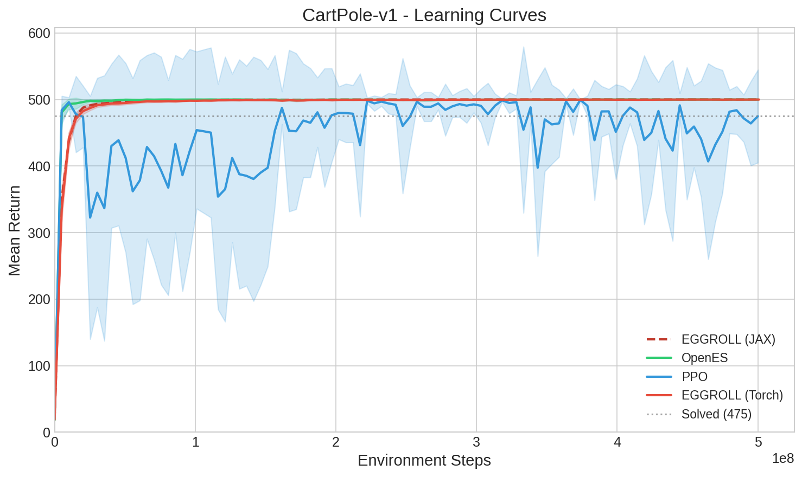
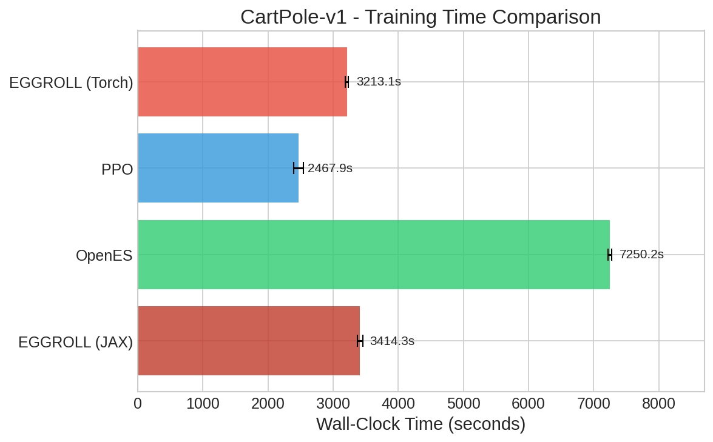
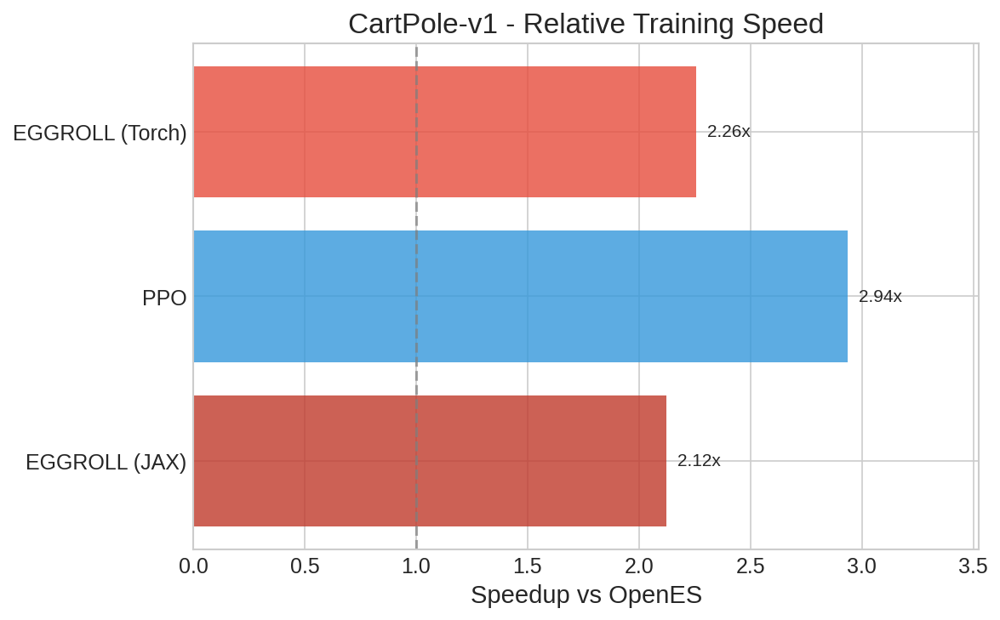
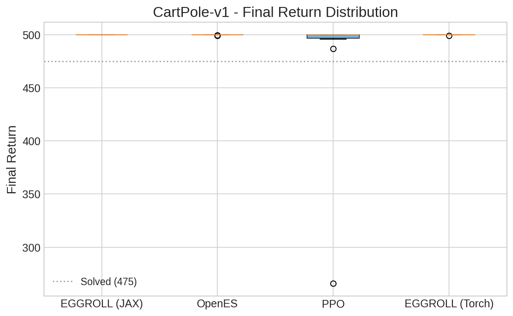

# CartPole-v1 Benchmark Results

## Overview

This benchmark replicates the **CartPole-v1** experiments from the EGGROLL paper
([Section G.1, Figure 9](https://arxiv.org/abs/...)). We compare:

- **EGGROLL** - Low-rank Evolution Strategies with efficient gradient estimation
- **PPO** - Proximal Policy Optimization (gradient-based RL baseline)
- **OpenES** - Full-rank Evolution Strategies (ES baseline)

### Why This Matters

Evolution Strategies (ES) are an attractive alternative to gradient-based RL because they:
- Don't require backpropagation through time
- Are embarrassingly parallel across population members
- Can handle non-differentiable objectives and sparse rewards

However, standard ES (like OpenES) scales poorly with parameter count due to full-rank
perturbations. **EGGROLL** addresses this by using low-rank perturbations, achieving
similar sample efficiency with dramatically reduced compute.

---

## Experiment Configuration

| Setting | Value |
|---------|-------|
| Environment | `CartPole-v1` |
| Max Steps | 500,000,000 |
| Seeds | 10 per method |
| Date | 2025-12-30 17:20:04 |

## Learning Curves



*Mean return over environment steps. Shaded regions show ±1 standard deviation across seeds.*
*Dashed line at 475 indicates the 'solved' threshold for CartPole-v1.*

## Summary Table

| Method | Final Return | Best Return | Wall Time (s) | Steps to Solve | Speedup vs OpenES |
|--------|--------------|-------------|---------------|----------------|-------------------|
| EGGROLL (JAX) | 500.0 ± 0.0 | 500.0 ± 0.0 | 3414.3 ± 41.5 | 15,495,267 ± 811,224 | **2.12x** |
| OpenES (JAX) | 499.9 ± 0.3 | 500.0 ± 0.0 | 7250.2 ± 26.6 | 4,687,479 ± 1,483,250 | 1.00x (baseline) |
| PPO (Rejax) | 474.8 ± 69.8 | 500.0 ± 0.0 | 2467.9 ± 72.6 | 1,644,000 ± 347,079 | **2.94x** |
| EGGROLL (Torch) | 499.9 ± 0.2 | 500.0 ± 0.0 | 3213.1 ± 23.7 | 17,180,004 ± 1,983,940 | **2.26x** |

## Training Time Comparison



## Speedup vs OpenES



*EGGROLL's low-rank perturbations require less compute than OpenES's full-rank perturbations,*
*while PPO benefits from efficient GPU parallelization of gradient computation.*

## Final Return Distribution



## Key Findings

1. **Best Final Return:** EGGROLL (JAX)
2. **Fastest Training:** PPO (Rejax)
3. **Fastest to Solve (≥475):** PPO (Rejax) at 1,644,000 steps

### EGGROLL vs OpenES

- EGGROLL is **2.26x faster** than OpenES
- EGGROLL achieves **0.0 higher** final return

## Hyperparameters

All hyperparameters match those in Tables 3 and 19 of the EGGROLL paper.

<details>
<summary><b>EGGROLL (JAX)</b></summary>

| Parameter | Value |
|-----------|-------|
| `activation` | `pqn` |
| `deterministic_policy` | `False` |
| `layer_size` | `256` |
| `learning_rate` | `0.1` |
| `lr_decay` | `0.9995` |
| `n_layers` | `3` |
| `n_parallel_evaluations` | `1` |
| `optimizer` | `sgd` |
| `pop_size` | `2048` |
| `rank` | `4` |
| `rank_transform` | `False` |
| `sigma` | `0.2` |
| `sigma_decay` | `0.999` |

</details>

<details>
<summary><b>OpenES (JAX)</b></summary>

| Parameter | Value |
|-----------|-------|
| `activation` | `pqn` |
| `deterministic_policy` | `True` |
| `layer_size` | `256` |
| `learning_rate` | `0.1` |
| `lr_decay` | `0.9995` |
| `n_layers` | `3` |
| `n_parallel_evaluations` | `4` |
| `optimizer` | `adamw` |
| `pop_size` | `512` |
| `rank_transform` | `True` |
| `sigma` | `0.5` |
| `sigma_decay` | `0.9995` |

</details>

<details>
<summary><b>PPO (Rejax)</b></summary>

| Parameter | Value |
|-----------|-------|
| `clip_eps` | `0.2` |
| `ent_coef` | `0.0001` |
| `gae_lambda` | `0.9` |
| `gamma` | `0.995` |
| `layer_size` | `256` |
| `learning_rate` | `0.0003` |
| `max_grad_norm` | `0.5` |
| `n_layers` | `3` |
| `normalize_obs` | `True` |
| `normalize_rew` | `False` |
| `num_envs` | `256` |
| `num_epochs` | `4` |
| `num_minibatches` | `32` |
| `num_steps` | `128` |
| `vf_coef` | `0.5` |

</details>

<details>
<summary><b>EGGROLL (Torch)</b></summary>

| Parameter | Value |
|-----------|-------|
| `activation` | `pqn` |
| `deterministic_policy` | `False` |
| `layer_size` | `256` |
| `learning_rate` | `0.1` |
| `lr_decay` | `0.9995` |
| `n_layers` | `3` |
| `n_parallel_evaluations` | `1` |
| `optimizer` | `sgd` |
| `pop_size` | `2048` |
| `rank` | `4` |
| `rank_transform` | `False` |
| `sigma` | `0.2` |
| `sigma_decay` | `0.999` |

</details>

## Individual Run Details

<details>
<summary>Click to expand per-seed results</summary>

| Method | Seed | Final Return | Best Return | Wall Time (s) | Steps to Solve |
|--------|------|--------------|-------------|---------------|----------------|
| EGGROLL (JAX) | 42 | 500.0 | 500.0 | 3294.7 | 15,505,292 |
| EGGROLL (JAX) | 142 | 500.0 | 500.0 | 3434.9 | 15,524,784 |
| EGGROLL (JAX) | 242 | 500.0 | 500.0 | 3403.6 | 14,493,991 |
| EGGROLL (JAX) | 342 | 500.0 | 500.0 | 3422.5 | 16,414,429 |
| EGGROLL (JAX) | 442 | 500.0 | 500.0 | 3421.1 | 16,105,787 |
| EGGROLL (JAX) | 542 | 500.0 | 500.0 | 3421.3 | 13,993,906 |
| EGGROLL (JAX) | 642 | 500.0 | 500.0 | 3447.2 | 15,451,408 |
| EGGROLL (JAX) | 742 | 500.0 | 500.0 | 3435.7 | 15,852,392 |
| EGGROLL (JAX) | 842 | 500.0 | 500.0 | 3437.1 | 14,860,914 |
| EGGROLL (JAX) | 942 | 500.0 | 500.0 | 3425.2 | 16,749,766 |
| OpenES (JAX) | 42 | 500.0 | 500.0 | 7192.0 | 3,738,483 |
| OpenES (JAX) | 142 | 500.0 | 500.0 | 7270.5 | 4,584,382 |
| OpenES (JAX) | 242 | 500.0 | 500.0 | 7241.5 | 4,095,544 |
| OpenES (JAX) | 342 | 500.0 | 500.0 | 7226.6 | 4,456,020 |
| OpenES (JAX) | 442 | 499.4 | 500.0 | 7274.6 | 4,566,714 |
| OpenES (JAX) | 542 | 499.1 | 500.0 | 7249.7 | 3,805,887 |
| OpenES (JAX) | 642 | 500.0 | 500.0 | 7238.0 | 2,892,699 |
| OpenES (JAX) | 742 | 500.0 | 500.0 | 7265.1 | 4,259,160 |
| OpenES (JAX) | 842 | 500.0 | 500.0 | 7252.7 | 5,919,087 |
| OpenES (JAX) | 942 | 500.0 | 500.0 | 7290.8 | 8,556,818 |
| PPO (Rejax) | 42 | 500.0 | 500.0 | 2429.8 | 1,590,000 |
| PPO (Rejax) | 142 | 265.9 | 500.0 | 2399.6 | 1,410,000 |
| PPO (Rejax) | 242 | 500.0 | 500.0 | 2534.6 | 1,690,000 |
| PPO (Rejax) | 342 | 486.6 | 500.0 | 2329.2 | 1,170,000 |
| PPO (Rejax) | 442 | 500.0 | 500.0 | 2523.5 | 2,330,000 |
| PPO (Rejax) | 542 | 500.0 | 500.0 | 2549.2 | 2,080,000 |
| PPO (Rejax) | 642 | 500.0 | 500.0 | 2478.2 | 1,560,000 |
| PPO (Rejax) | 742 | 495.7 | 500.0 | 2534.4 | 1,870,000 |
| PPO (Rejax) | 842 | 500.0 | 500.0 | 2386.6 | 1,530,000 |
| PPO (Rejax) | 942 | 500.0 | 500.0 | 2514.0 | 1,210,000 |
| EGGROLL (Torch) | 42 | 500.0 | 500.0 | 3179.1 | 16,064,186.0 |
| EGGROLL (Torch) | 142 | 500.0 | 500.0 | 3180.5 | 14,470,236.0 |
| EGGROLL (Torch) | 242 | 500.0 | 500.0 | 3208.9 | 15,283,908.0 |
| EGGROLL (Torch) | 342 | 500.0 | 500.0 | 3203.5 | 21,707,930.0 |
| EGGROLL (Torch) | 442 | 500.0 | 500.0 | 3218.4 | 18,549,495.0 |
| EGGROLL (Torch) | 542 | 499.9 | 500.0 | 3248.6 | 16,881,904.0 |
| EGGROLL (Torch) | 642 | 500.0 | 500.0 | 3255.4 | 18,295,406.0 |
| EGGROLL (Torch) | 742 | 499.9 | 500.0 | 3205.7 | 17,966,088.0 |
| EGGROLL (Torch) | 842 | 499.2 | 500.0 | 3207.2 | 15,494,854.0 |
| EGGROLL (Torch) | 942 | 500.0 | 500.0 | 3224.0 | 17,086,035.0 |

</details>

---

## Reproducing These Results

```bash
# Install dependencies
uv sync

# Run the benchmark
uv run python benchmarks/benchmark_cartpole.py \
    --methods jax_eggroll openes ppo torch_eggroll \
    --num-seeds 10 \
    --max-steps 500000000
```
